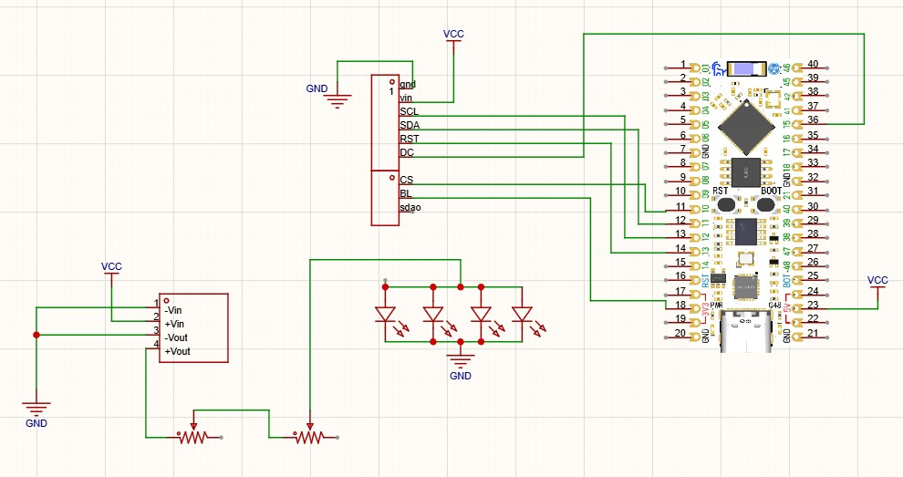

# Network_picture

ESP32 project that visualizes your local network as a space map on an ST7796 display (320×480). Devices on `10.0.0.x` appear as orbiting stars around the router; nearby Wi‑Fi networks show up as galaxies.

## Hardware

Wiring schematic:



### Display (SPI / ST7796)

| Display pin | MCU pin |
|-------------|---------|
| SCL         | 12      |
| SDA         | 11      |
| RST         | 14      |
| DC          | 15      |
| CS          | 10      |
| BL          | 9       |
| VIN         | VCC     |
| GND         | GND     |

### Power & LEDs

- Buck/boost module feeds the LED bank from `+Vout` through series resistors.
- Four LEDs in parallel (anodes via the resistor chain, cathodes to GND).
- MCU pin 18 ties into the LED supply path for control/sensing.

## Firmware

Main sketch: [`network_picture.ino`](network_picture.ino)

- **LovyanGFX** — ST7796 over SPI  
- **WiFi** + **ESP32Ping** — scan LAN hosts and nearby SSIDs  
- Background FreeRTOS task for network scanning; main loop draws the orbital UI  

Set your Wi‑Fi credentials in the sketch before uploading:

```cpp
const char* ssid = "";
const char* password = "";
```
